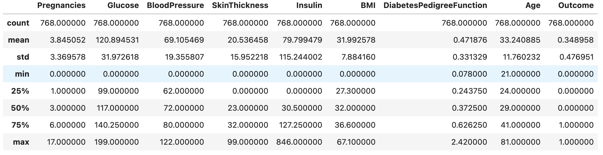
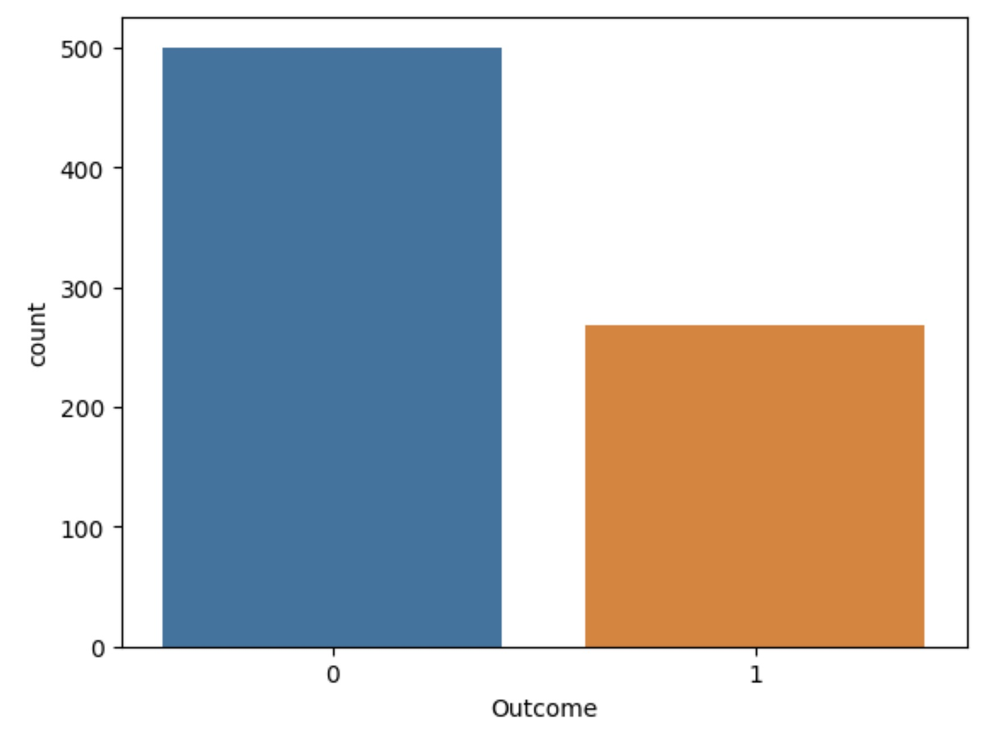
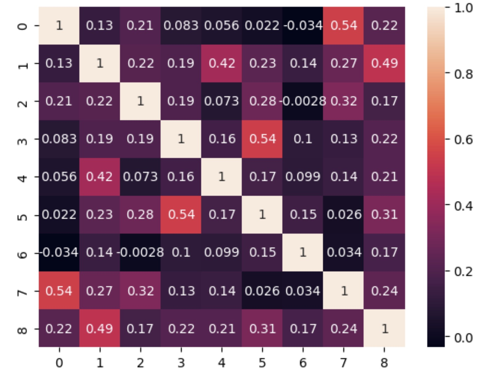
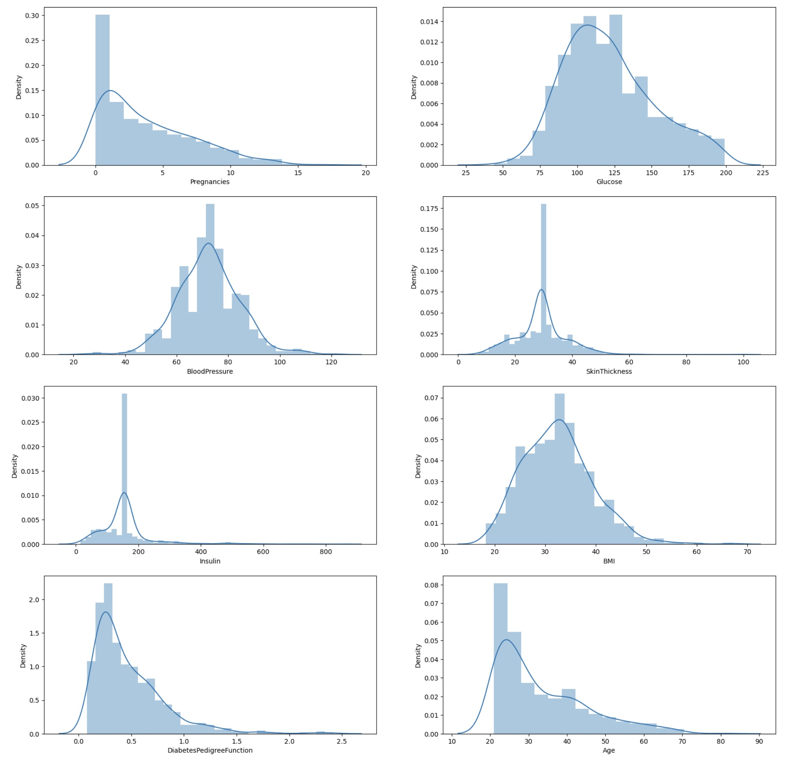
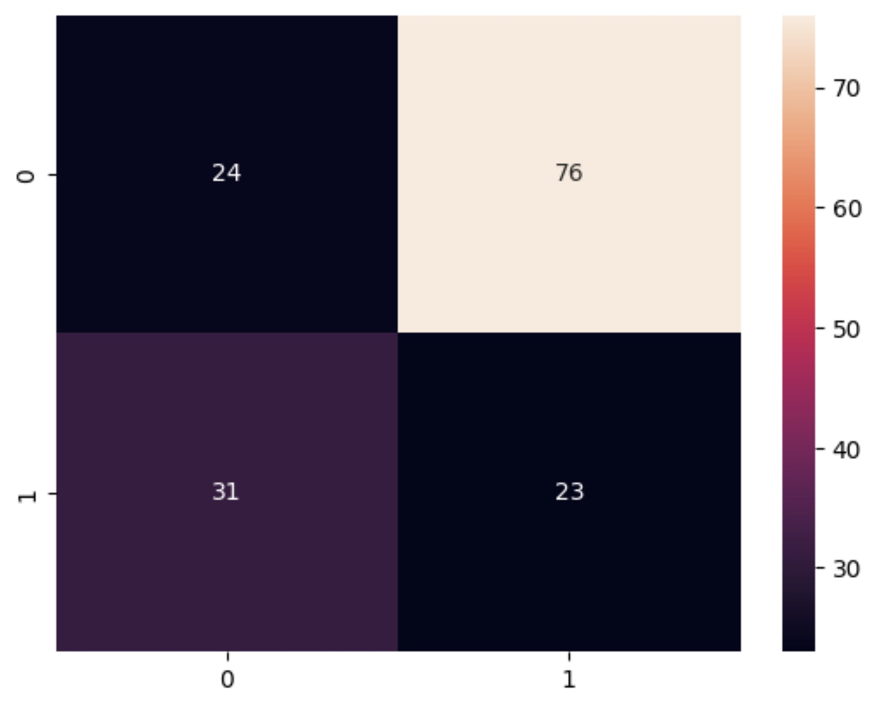
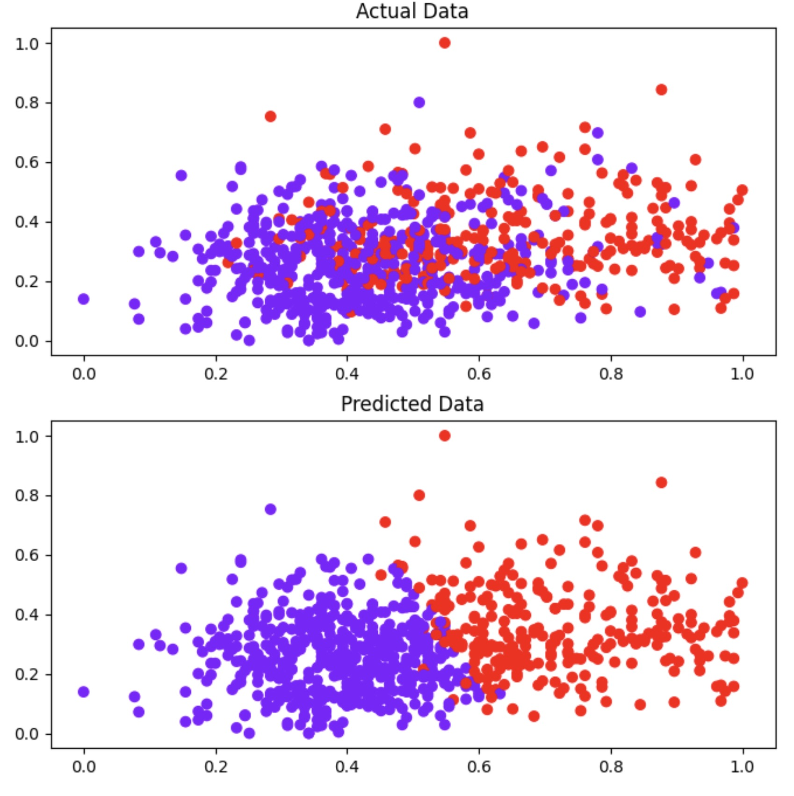

---
documentclass: article
classoption:
title: "CSCE 585: Machine Learning Systems:
Course Project: Progress Report III"
author: Shima Oruji and Zach Thomas
institute: UofSC
date: \today
colorlinks: true
linkcolor: blue
citecolor: green
urlcolor: cyan
...

\tableofcontents

\clearpage

# Summary
We have continued work on our project, aiming to accomplish what we proposed while implementing your suggestions and feedback on the proposal and previous milestones. We have created a huge Jupyter notebook report using code from multiple resources to evaluate performance of random forest, decision tree, neural network and support vector machine models. We also compare this to unsupervised learning methods, such as k-means clustering, to highlight the effectiveness of these models. We have also developed these models from scratch for this project, as to demonstrate a deep understanding of the mathematical and algorithmic processes of these models. 

We have put our final report draft into our github for our milestone 3 progress, with sections currently finished including decision tree, random forest, and neural network model analysis, with our analysis on support vector machines in progress. This report goes into detail about our process to analyze the data,  where we highlight attributes of the data and check for cleanliness, and detail our observations. The importance of each feature of the data to determine the outcome, or the onset of diabetes, is calculated by scaling the data using a sigmoid function and graphing the results on a heatmap. We include additional visualizations to highlight the correlations between Glucose, BMI and Age as factors for diabetes. 

Based on the given feedback, we continued working on the project with the aim of preparing a comprehensive empirical study on the given dataset and defined problem. Our analysis includes performing: (1) raw data analysis to gain insight on the dataset from various statistical perspectives, (2) unsupervised learning to evaluate its performance on the defined problem and the given dataset, (3) supervised learning to evaluate its performance on the defined problem and the given dataset, and (4) analysis on the implementation of application programing interface (API) as the last step when we deploy the trained model for usage. The detailed explanations and results are given in the following sections. The detailed code, analysis, and explanations of our progress can be found in these github links: [link1](https://github.com/shima-oruji-chem/ML-Course/blob/main/Code/Diabetes%20Prediction%20Report.ipynb), [link1](https://github.com/shima-oruji-chem/ML-Course/blob/main/Code/Random%20Forest.ipynb), [link1](https://github.com/shima-oruji-chem/ML-Course/tree/main/API).

# Problem Statement
Diabetes Mellitus is among critical diseases and lots of people are suffering from it in recent years. According to the recent studies, age, obesity, lack of exercise, hereditary diabetes, living style, bad diet, high blood pressure, etc. can cause Diabetes Mellitus. People having diabetes have high risk of diseases such as heart disease, kidney disease, stroke, eye problem, and nerve damage. With the recent advancements in the field of machine learning (ML), several researchers have tried to apply ML models to perform Diabetes prediction in patients based on various factors. However, there is no rigorous and comprehensive study on the evaluation of different ML models to determine the best practices in this specific problem.

In this project, we aim at implementing and evaluating different classification methods (e.g., decision tree, random forest, support vector machine, and neural network) on the given dataset. We will use the Pima Indians onset of diabetes dataset. This is a standard machine learning dataset from the UCI Machine Learning repository. It describes patient medical record data for Pima Indians and whether they had an onset of diabetes within five years.

# Detailed Data Analysis
Our dataset includes 768 data points, each of which having 8 features and 1 label. For Each row in the dataset (all numeric-valued), we have the following columns:

* Number of times pregnant
* Plasma glucose concentration a 2 hours in an oral glucose tolerance test
* Diastolic blood pressure (mm Hg)
* Triceps skin fold thickness (mm)
* 2-Hour serum insulin (mu U/ml)
* Body mass index (weight in kg/(height in m)^2)
* Diabetes pedigree function
* Age (years)
* Class variable or label (0 or 1) - 1 represents the positive diabetes and 0 denotes the negative diabetes

First, we started by performing data analysis on the given dataset to gain insight on it from various points of view. The data type for each of the dataset columns is as:

* Pregnancies                   int64
* Glucose                       int64
* BloodPressure                 int64
* SkinThickness                 int64
* Insulin                       int64
* BMI                         float64
* DiabetesPedigreeFunction    float64
* Age                           int64
* Outcome                       int64

Also, the below figure shows the statistical information (i.e., count, average, standard deviation, minimum, maximum, 25%, 50%, and 75%) on each of the dataset columns.

According to this figure, we can see that the average value for the output label column is 0.34 which implies that the dataset is imbalanced and the number of 0s is more than the number of 1s. We have verified this by ploting the count of each labels as shown in Figure 2. Another important observation was that some features like Glucose, Blood pressure , Insulin, BMI have zero values which represent missing data in the dataset.

{width=80% height=80%}

Now, let's discuss the importance of the features and their overall affect on the labels of the dataset. A heatmap is a graphical representation of data that uses a system of color-coding to represent different values. Here, a heatmap graph can show the correlation between the features and the output label. Based on the results, one can easily determine which features are the most important ones in the dataset.

From the correaltion heatmap, we can see that there is a high correlation between Outcome and Glucose,BMI,Age features. In a practical scenario like our case, we can select these features in our website to accept input from the user and predict the outcome. An alternative would be making these features mandatory inputs and make the others optional to a user to predict how likely he/she will be diagnosed with Diabetes. These results are consistent with the pair plots and violin plots that are given in the [notebook](https://github.com/shima-oruji-chem/ML-Course/blob/main/Code/Diabetes%20Prediction%20Report.ipynb). In addition to this, the violin plot shows that the BloodPressure feature is almost useless as it's violin shape is pretty similar for the given lables in our dataset. To visuallly gain further insight on the features, we can plot their probaility distribution functions (pdfs). In the perfect scenario, all the features must be represented by normal distribution. However, as can be seen, we don't have such distribution here. 

# Unsupervised Learning
In the previous section, we performed statistical analysis on our dataset to gain some insight on the features, their distribution, their importance (effect) on the prediction classes. In the next step, we will try to find the boundary between the labels with unsupervised learning. This can be done by separating the dataset into two different parts (clusters) and then see how much of the ground truth labels are matching the separated labels using the unsupervised learning approach.

## K-Means Clustering
One of the most famous unsupervised learning algorithms is K-means, which classifies the dataset into k different clusters. In our case, we alrady know that k = 2. Implementing the K-means cluster with k = 2, we onbtained the following confusion matrix results. It is obvious that the K-means clustering algorithm return very poor results in terms of the accuracy, precision, and recall. To show this interpretation, we also plot the actual data points and the clustered ones. Figure 6 shows both the actual dataset and the clustered one. As can be seen in the 2D representation of the dataset, the clustered dataset has so many wrong classified data points that causes its performance drop. Based on this observation, it is obvious that unsupervised learning is not able to classify the given dataset with reasonable accuracy, and hence, we will try to use supervised learning techniques in the next sections. 

With our understanding of the data, we then implement unsupervised and supervised learning methods onto the data to predict diabetes, and then comprehensively compare the different methods. Using k=2, we found a 31% accuracy with K-means clustering, which is very low. Our confusion matrix, which maps the predicted and actual outcomes on a 4 quadrant graph, shows high rates of false positives. We also created user input to allow this model to predict user attributes, assuming they enter within the range of 0 to 1.We took note of the high rate of false positives from K-means clustering, as compared to false negatives. We are unsure as to why this is, though it could just be a feature of this dataset. 

# Supervised Learning
We implemented multiple well-known supervised learning algorithms (i.e., artificial neural network, support vector machine, random forrest) on the given dataset. The accuracy of the trained models are 0.67, 0.759, and 0.818 which are associated with ANN, SVM, and Random Forrest models, respectively. Based on the obtained results, it seems that the Random Forrest reveals the best performance on this dataset. However, we noticed that the performance of the trained models are heavily depend on their hyperparameters and we cannot make a general conclusion about the superirity of a specific model. In fact, one can train an ANN model with the higher performance than that of the Random Forrest. Another important point is that the performance of the supervised learning algorithms is much better than that of the unsupervised learning method we used earlier. The reason behind this observation is that we use additional useful information (data point labels) in the training phase and this leads to better overall performance. The detailed code and results associated with the supervised learning algorithms can be found in [here](https://github.com/shima-oruji-chem/ML-Course/blob/main/Code/Diabetes%20Prediction%20Report.ipynb) and [here](https://github.com/shima-oruji-chem/ML-Course/blob/main/Code/Random%20Forest.ipynb).

For supervised learning, we are comparing decision trees, random forest, support vector machines and neural network models to one another and to k-means clustering. We defined a neural network function to generate our model and then provided a summary of its layers and features. We found a 73% accuracy, which has been our highest accuracy so far. We also configured our generated neural network to be quite large, with three layers and tens of thousands of parameters. Finally, our support vector machines had an accuracy just a bit above the neural network at 75.9%. This difference is likely just incidental and not indicative of the superiority of support vector machines over neural network models, but it certainly shows their capability. 

## Jupyter Notebook Report

Our Jupyter notebook report of the performance of the decision tree and random forest is currently in its own file. Our analysis used very similar methods used for the K-means clustering and neural network analysis, using heatmaps, scatterplots, and normal graphs to determine the attributes which have the highest correlation with diabetes outcome. Our notebook also contains decision tree prediction graphs, with sections shaded either blue or orange for predicted results for a given input, with a blue square and orange triangle for actual data entries. These show that Glucose, BloodPressure, and Pregnancies are the best attributes for predicting diabetes onset, as they do the best job of correctly mapping the data to the prediction zones. We finished with a ROC curve, which is a common modeling graph showcasing the model’s performance compared to a random graph, and found for a false positive rate over 0.6 the true positive rate was 1.0. The graph overall showed the model had substantial strength, especially for a high false positive rate. This result was unpredicted by us, as we considered our model to not yet be fully developed and so we expected the strength to be much weaker initially.

Other than our Jupyter notebook reports, we have also calculated accuracy for our random forest and decision tree we made from scratch, which came out to 62.3% and 55%, respectively. These results were about as expected, with higher accuracy than an unsupervised learning method such as k-clustering, but lower than more involved models such as neural networks. The increased accuracy of random forest is also expected, since a random forest makes use of multiple decision trees, and so should increase accuracy. We would be surprised, however, if the accuracy of our random forest could not be improved with different development methods or a different application. 

# Application Programming Interface (API)
The API we are developing for this application is a Flask-RESTful API which has been developed in python. This API gets the features of a sample data point as input in a json data format for an http POST request and predicts the probability of the diabetes for the given input. The trained model gets serialized and saved as a pickle file and the API loads the pickle file and then makes a prediction based on the de-serialized model object. For the input, we considered the most important features (i.e., Glucose, BMI, Age) as mandatory and the others as optional. If the user does not provide the optional features, we replace them with the average values as they should not have significant effects on the model prediction according to our data analysis. As we know, we used classification methods to train our algorithm however, we are returning a float number as the output of the API. To achive this in the neural network model, we do not discretize the final output of the neural network. Instead, we return the raw number which is between 0 and 1 as the probaility of diabetes as it makes more sense in real life. The detailed code and explanation of the developed dataset can be found in [here](https://github.com/shima-oruji-chem/ML-Course/tree/main/API). The API can be easily tested with a simple curl command in terminal as explained in the github readme file. 